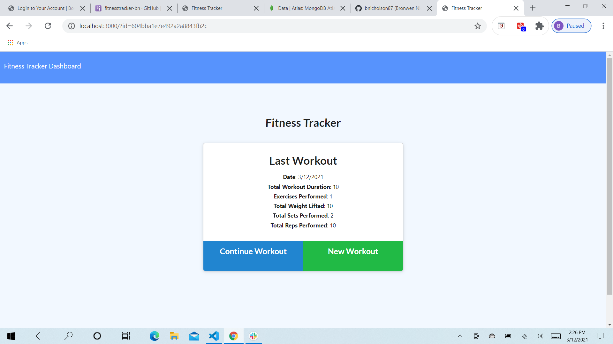

# Fitness Tracker

  An app where you can keep track of which exercises you have done each day and for how long.  It also helps you keep track of the weight you have lifted.

  # Table of Contents:
  *[Installation](#installation)
  *[Usage](#usage)
  *[Test](#test)
  *[Contributions](#contributions)
  *[Questions](#questions)
  *[License](#license)
  
  
  ## Installation 
  
  Express, morgan and mongoose are required
  
  ## Usage
  
 When you click on either "new exercise" or "continue exercise", it will prompt you to fill out the details (i.e. name, duration, etc.), and the information you put in will be saved for your review.

 ## Test

 By running it to make sure it works
  
  ## Contributions
  
  Individual assignment

  ## License
  
  None

  ## Questions

  GitHub Userame: bnicholson87
  GitHub Profile Link: https://github.com/bnicholson87
  Email: bnicholson091@gmail.com

  Screenshot: 

  https://github.com/bnicholson87/FitnessTracker.git
